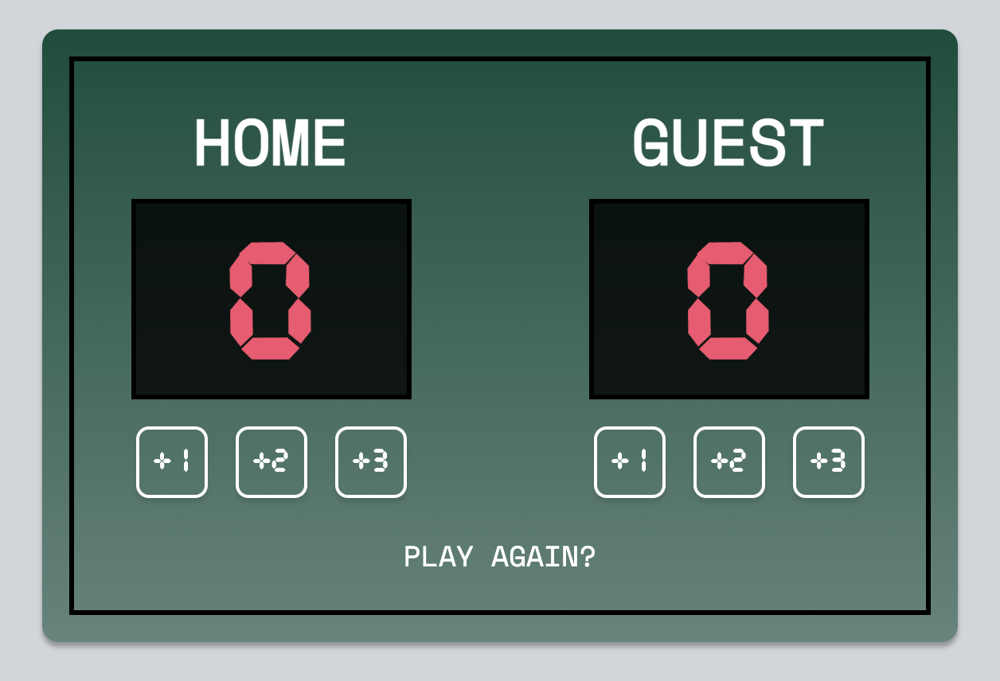

# Basketball Scoreboard

## Description 

For this mini project, I followed a figma design given by Scrimba as means to create a basketball scoreboard (to see the template, [see here](https://www.figma.com/file/YC48MCx4frBFtYoz6rNJE6/Basketball-Scoreboard?node-id=0%3A1)). It is important to point out that I only followed the design template loosely as I wanted to put my own twist to it. The technologies used were HTML, CSS and vanilla JavaScript. 

## Links

[Press here](https://cedekpoole.github.io/basketball-scoreboard/) to see the scoreboard in action.

## Usage 

Click the buttons to increase the score. If you want to reset the game, press 'Play Again?' at the bottom of the board. 

## Credit

This is a solo project that can be found in the JavaScript path of [Scrimba](https://scrimba.com/).

## License 

N/A